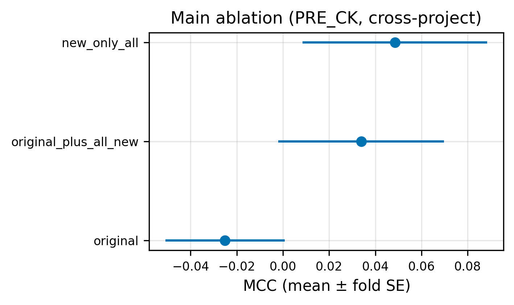
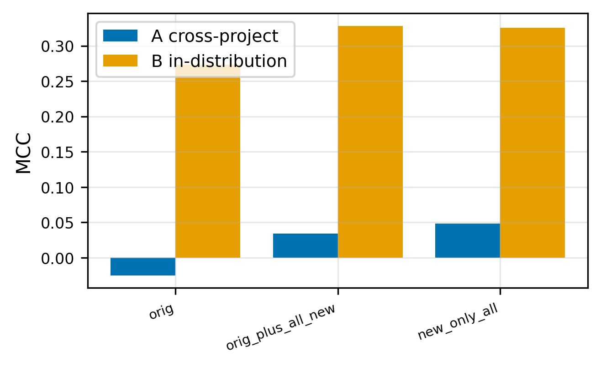
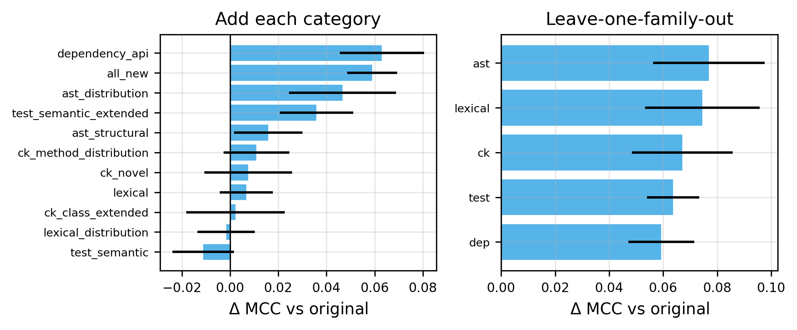
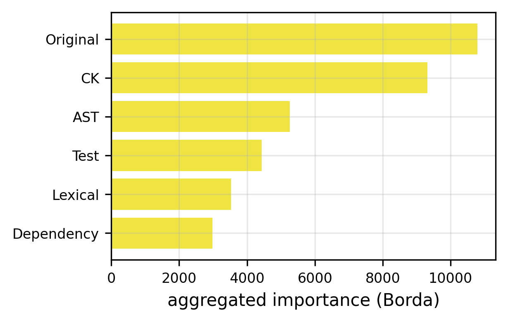
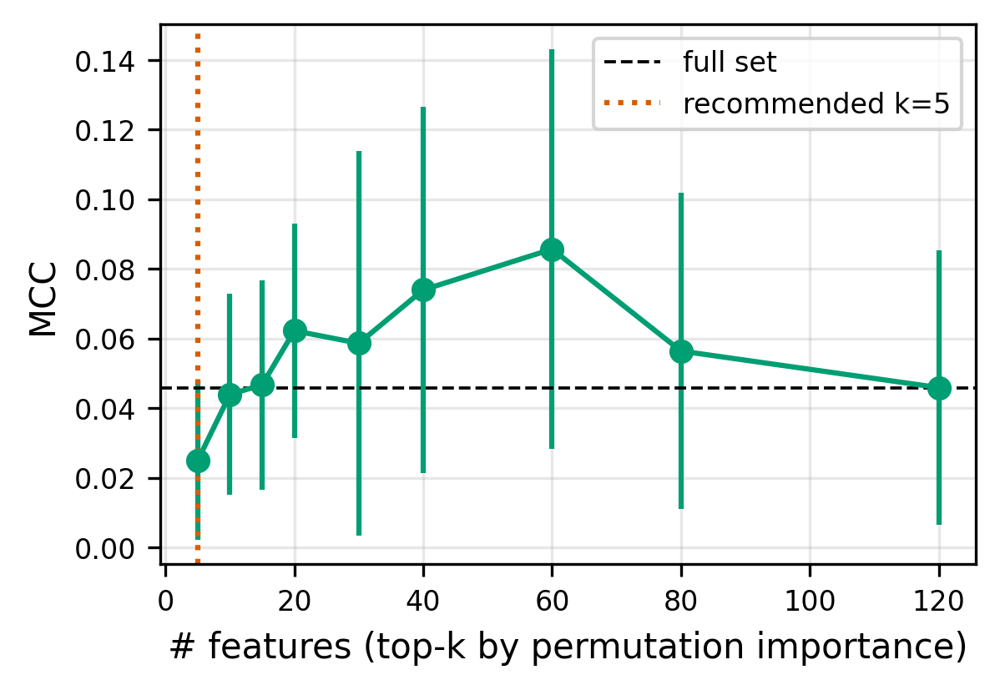

# Báo cáo kết quả - Dự đoán refactoring test code (pre-state)

**Kết luận một dòng:** Ở thiết lập **cross-project** (cùng họ với thực tế triển khai), các đặc trưng tĩnh đo ở trạng thái *trước* refactoring **gần như không dự đoán được** `isRefactored` (MCC ≈ 0). Hiệu năng "có vẻ tốt" trong các nghiên cứu in-distribution chủ yếu đến từ **rò rỉ cùng-dự-án**, không phải tín hiệu tổng quát hóa được.

---

## 1. Cách làm (tóm tắt)

- **Bài toán:** phân loại nhị phân `isRefactored` cho từng file test Java.
- **Tính hợp lệ thời gian:** mọi đặc trưng đo ở **trạng thái pre-refactoring (Ra)** - tránh circularity (không "nhìn" trạng thái sau khi đã refactor).
- **Dữ liệu:** 4.280 mẫu, **41 đặc trưng gốc + 88 đặc trưng mới** (5 họ: CK, AST, Test-smell, Lexical, Dependency). Nhãn ~52% dương (cân bằng).
- **2 protocol kiểm định chéo (đều báo cáo):**
  - **A = StratifiedGroupKFold theo `App`** - *cross-project*, **số chính**: train và test không chung dự án.
  - **B = StratifiedKFold shuffled** - *in-distribution*, **chặn trên lạc quan** (cùng dự án có ở cả train/test), không bao giờ là số headline.
- **1 seed cố định × 5 fold**, dùng chung một partition cho mọi model/ablation.
- **6 model** khác biệt về inductive bias: Dummy, LogReg, Decision Tree, **Random Forest (chính)**, SVM-RBF, XGBoost.
- **Chống rò rỉ:** mọi tiền xử lý (impute + scale) fit *trong từng fold*; loại trùng đặc trưng (`|corr|≥0.99`) tiền-đăng-ký; chọn feature (RQ4) lồng nhau, importance chỉ tính trên inner-validation.
- **Bất định suy luận:** bootstrap **theo dự án** trên OOF gộp (không coi 5 fold chồng lấn là quan sát độc lập).

---

## 2. Kết quả

### 2.1 Tín hiệu cross-project gần như bằng 0 (F2)

MCC của các tập feature lõi (Protocol A, Random Forest) đều **quanh 0** với sai số fold lớn. Không tập nào tách bạch khỏi mức ngẫu nhiên.

### 2.2 Khoảng cách A-vs-B = mức thổi phồng do rò rỉ (F6)

| Tập feature | A (cross-project) | B (in-distribution) |
|---|---|---|
| original | −0.025 | 0.273 |
| original + all new | 0.034 | 0.328 |
| new only | 0.048 | 0.326 |

Khi cho phép cùng dự án xuất hiện ở train+test (B), MCC nhảy lên ~0.3. **Toàn bộ khoảng cách này là ảo giác do leakage**

### 2.3 Đặc trưng mới có nhỉnh hơn gốc, nhưng không chắc chắn về thống kê

Bootstrap theo dự án (OOF gộp):

| Tập | MCC | CI 95% |
|---|---|---|
| original | −0.036 | [−0.079, 0.020] |
| original + all new | 0.015 | [−0.059, 0.094] |
| **Δ (new − original)** | **+0.051** | **[−0.022, 0.115]** |

Đặc trưng mới cải thiện danh nghĩa **+0.05 MCC**, nhưng **khoảng tin cậy cắt qua 0** → chưa đủ bằng chứng khẳng định.

### 2.4 Đóng góp theo họ đặc trưng (F3, F4)

So sánh paired-fold (mô tả): họ **Dependency** đóng góp dương rõ nhất (`original_plus_dependency_api`: Δ≈+0.06); loại bỏ AST/Lexical ít gây hại. Lưu ý: đây là so sánh mô tả mức fold, cần đọc cùng bất định ở §2.3.

### 2.5 RQ4 - tập con gọn (F5)

Đường compactness gần như **phẳng và nằm sát 0** ở mọi `k`. Tập đề cử hậu nghiệm gồm **5 feature** (`dep_annotation_type_diversity`, `dep_external_import_ratio`, `test_parameterized_annotation_count`, `AsD`, `ast_statement_ratio`). Vì hiệu năng nền ≈ 0, đây là **đề cử khám phá**, *không* tuyên bố là tập đã được validate độc lập.

### 2.6 F1-score và các chỉ số khác

Các chỉ số đầy đủ (PRE_CK, Protocol A, Random Forest, trung bình 5 fold):

| Tập feature | MCC | F1 | Precision | Recall | PR-AUC | ROC-AUC | Bal-Acc |
|---|---|---|---|---|---|---|---|
| original | −0.025 | 0.562 | 0.510 | 0.648 | 0.511 | 0.482 | 0.488 |
| original + all new | 0.034 | 0.596 | 0.531 | 0.718 | 0.543 | 0.527 | 0.514 |
| new only | 0.048 | 0.607 | 0.536 | 0.740 | 0.544 | 0.531 | 0.521 |

**Cảnh báo diễn giải:** F1 ≈ **0.60** trông "khá ổn", nhưng đó là **ảo giác**:
- Baseline **Dummy** (đoán ngẫu nhiên theo tỉ lệ lớp) đã đạt **F1 = 0.506** → mô hình tốt nhất chỉ nhỉnh hơn ~0.09.
- Cùng lúc đó **MCC ≈ 0.03** và **ROC-AUC ≈ 0.51–0.53** (gần 0.5) khẳng định: **gần như không phân biệt được**.
- F1 cao là do **recall bị đẩy lên** (mô hình đoán "dương" nhiều) trên tập ~52% dương, chứ không phải vì dự đoán đúng.

Đây chính là lý do nghiên cứu dùng **MCC làm chỉ số chính**: F1 bỏ qua true-negative và nhạy với tỉ lệ lớp nên che giấu việc mô hình ở mức ngẫu nhiên.

F1 cũng chỉ ra khoảng cách A-vs-B (RF, `original + all new`):

| Protocol | MCC | F1 | PR-AUC | ROC-AUC |
|---|---|---|---|---|
| A (cross-project) | 0.034 | 0.596 | 0.543 | 0.527 |
| B (in-distribution) | 0.328 | 0.696 | 0.738 | 0.735 |

> Mọi giá trị F1/precision/recall/PR-AUC/ROC-AUC cho **mọi** model · set · fold đều có trong `results/metrics/registry.csv`.

---
